# β - VAE

This is an implementation of β-variational auto-encoders (β-VAE), the state-of-the-art model for unsupervised visual disentangled representation learning. This work replicating DeepMind's papers ["β-VAE: Learning Basic Visual Concepts with a Constrained Variational Framework"](https://openreview.net/forum?id=Sy2fzU9gl) and ["Understanding disentangling in β-VAE"](https://arxiv.org/abs/1804.03599)

## What is disentanglement?

A disentangled representation can be defined as one where single latent units are sensitive to changes in single generative factors, while being relatively invariant to changes in other factors. Here a feature representation can be thought of as a coordinate system with each latent unit being one of its many axes. There are many ways to extract independent feature representations (PCA and ICA decompositions), however independence does not guarantee disentanglement. Take for instance a 2D coordinate system with generative factors as  and  vectors. While  and  form independent factors in 2D space, they are not disentangled, i.e., change of one latent factor will affect multiple generative factors.

## Why do we need disentanglement?

## Dataset Description

[dSprites](https://github.com/deepmind/dsprites-dataset) is a dataset of 2D shapes procedurally generated from 6 ground truth independent latent factors. These factors are color, shape, scale, rotation, x and y positions of a sprite.

All possible combinations of these latents are present exactly once, generating N = 737280 total images.

* Color: white
* Shape: square, ellipse, heart
* Scale: 6 values linearly spaced in [0.5, 1]
* Orientation: 40 values in [0, 2 pi]
* Position X: 32 values in [0, 1]
* Position Y: 32 values in [0, 1]

- `imgs` : (737280 x 64 x 64, uint8) Images in black and white.
- `latents_values` : (737280 x 6, float64) Values of the latent factors.
- `latents_classes` : (737280 x 6, int64) Integer index of the latent factor values. Useful as classification targets.
- `metadata` : some additional information, including the possible latent values.

## 2D shape disentaglement

Result by changing latent Z from -3.0 to 3.0 with γ=100.0 and C=20.0

Latent variables with small variances seem extracting "x", "y", "rotation" and "scale" parameters.

(This experiment is using DeepMind's [dsprite data set](https://github.com/deepmind/dsprites-dataset).)

Z  | Image                             | Parameter | Variance
---| ----------------------------------|---------- |-------
z0 |  |           | 0.9216
z1 |  |           | 0.9216
z2 | 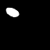 | Rotation  | 0.0011
z3 |  | Rotation? | 0.0038
z4 |  | Pos X     | 0.0002
z5 |  |           | 0.9384
z6 | 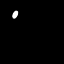 | Scale?    | 0.0004
z7 |  |           | 0.8991
z8 |  |           | 0.9483
z9 |  | Pos Y     | 0.0004

## Reconstruction result

Left: original Right: reconstructed image

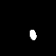
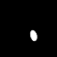

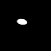

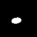

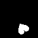
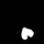

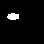
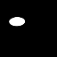

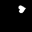

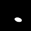
