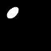
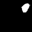
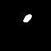

# β - VAE

This is an implementation of β-variational auto-encoders (β-VAE), the state-of-the-art model for unsupervised visual disentangled representation learning. This work replicating DeepMind's papers ["β-VAE: Learning Basic Visual Concepts with a Constrained Variational Framework"](https://openreview.net/forum?id=Sy2fzU9gl) and ["Understanding disentangling in β-VAE"](https://arxiv.org/abs/1804.03599).

## What is disentanglement?

A disentangled representation can be defined as one where single latent units are sensitive to changes in single generative factors, while being relatively invariant to changes in other factors. Here a feature representation can be thought of as a coordinate system with each latent unit being one of its many axes. There are many ways to extract independent feature representations (PCA and ICA decompositions), however independence does not guarantee disentanglement. Take for instance a 2D coordinate system with generative factors as  and  vectors. While  and  form independent factors in 2D space, they are not disentangled, i.e., change of one latent factor will affect multiple generative factors.

## Why do we need disentanglement?

- good interpretability
- aids an RL agent to achieve better transfer performance outside of the training data distribution
- a step towards the generality and robustness of biological intelligence

### Usefulness?

- A model trained on a dataset of 3D objects might learn independent latent units sensitive to single independent data generative factors, such as object identity, position, scale, lighting or colour, thus acting as an inverse graphics model (Kulkarni et al., 2015).
- Scenarios which require knowledge transfer, where faster learning is achieved by reusing learnt representations for numerous tasks.
- zero-shot inference, where reasoning about new data is enabled by recombining previously learnt factors.

## Some thoery

Follows the variational autoencoder (VAE) framework with an adjustable hyperparameter β (β = 1 corresponds to regular VAE). This hyperparameter imposes a limit on the capacity of the latent information channel and an emphasis on learning statistically independent latent factors. This, when combined with the data log likelihood maximisation objective of generative models, leads to the model acquiring the most efficient latent representation of the data, which is disentangled if the data is produced using at least some ground truth factors of variation that are independent.

The above equation forms the ELBO objective function that needs to be **maximized**. While the first term accounts for reconstruction fidelity, the second term is a measure of the KL distance of learnt posterior and Gaussian prior *p(z)* (puts implicit independence pressure due to the isotropic nature of Gaussian prior). Higher values of β should encourage learning a more disentangled representation. The extra pressures coming from high β values, however, may create a trade-off between reconstruction fidelity and the quality of disentanglement within the learnt latent representations.

The latest [paper](https://arxiv.org/abs/1804.03599) suggests new intuitions and theoretical assessments of the emergence of disentangled representation in variational autoencoders. It proposes a modification to the training regime of β-VAE, that progressively increases the information capacity of the latent code during training. This modification facilitates the robust learning of disentangled representations in β-VAE, without the previous trade-off in reconstruction accuracy. The new objective function is as follows:

where *C* is the latent encoding capacity that is linearly increased over 100,000 training steps from 0 to 25 nats. This step enables progressively more factors of variation to be represented whilst retaining disentangling in previously learned factors.  is chosen as 1000, which is large enough to ensure the actual KL remains close to the target KL (*C*).

> Note: The second term takes the absolute of difference between the actual and target KL. This is important because the objective is to minimize the absolute difference (i.e., magnitude) and when it changes its sign (+ve to -ve, or -ve to +ve), the corresponding gradient directions also shall reverse. Taking a large *C* thus ensures that the 1st term is maximized, while constraining the network's capacity in the close neighborhood of target KL.

## Model Architecture

- `conv_beta_vae` : The encoder for the VAEs consists of 4 convolutional layers, each with 32 channels, 4x4 kernels, and a stride of 2. This is followed by 2 fully connected layers, each of 256 units. The latent distribution consists of one fully connected layer of 20 units parametrising the mean and log standard deviation of 10 Gaussian random variables. The decoder architecture is simply the transpose of the encoder, but with the output parametrising Bernoulli distributions over the pixels.
- `beta_vae` : Input(4096, flattened)->FC(1200)->FC(1200)->FC(10)->FC(1200)->FC(1200)->FC(1200)->FC(4096)
- ReLU activations are used throughout.
- Adam optimiser with a learning rate of 5e-4 is used to train the network.

## Dataset Description

[dSprites](https://github.com/deepmind/dsprites-dataset) is a dataset of 2D shapes procedurally generated from 6 ground truth independent latent factors. These factors are color, shape, scale, rotation, x and y positions of a sprite.

All possible combinations of these latents are present exactly once, generating N = 737280 total images.

* Color: white
* Shape: square, ellipse, heart
* Scale: 6 values linearly spaced in [0.5, 1]
* Orientation: 40 values in [0, 2 pi]
* Position X: 32 values in [0, 1]
* Position Y: 32 values in [0, 1]

- `imgs` : (737280 x 64 x 64, uint8) Images in black and white.
- `latents_values` : (737280 x 6, float64) Values of the latent factors.
- `latents_classes` : (737280 x 6, int64) Integer index of the latent factor values. Useful as classification targets.
- `metadata` : some additional information, including the possible latent values.

## Results

Result by changing latent Z from -3.0 to 3.0 with γ=100.0 and C=20.0

Latent variables with small variances seem extracting "x", "y", "rotation" and "scale" parameters.

(This experiment is using DeepMind's [dsprite data set](https://github.com/deepmind/dsprites-dataset).)

Z  | Image                             | Parameter | Variance |    | Z  | Image                             | Parameter | Variance
---| ----------------------------------|---------- |----------|----|----| ----------------------------------|---------- |-------
z0 |  |           | 0.9216   |    | z5 |  |           | 0.9384
z1 |  |           | 0.9216   |    | z6 |  | Scale?    | 0.0004
z2 |  | Rotation  | 0.0011   |    | z7 |  |           | 0.8991
z3 |  | Rotation? | 0.0038   |    | z8 |  |           | 0.9483
z4 |  | Pos X     | 0.0002   |    | z9 |  | Pos Y     | 0.0004

## Reconstruction

| Original Image              | Reconstructed Image              |   | Original Image              | Reconstructed Image
| ----------------------------|----------------------------------|---| ----------------------------|---------------------------------
|  |  |   |  | 
|  |  |   |  | 
|  |  |   |  | 
|  |  |   |  | 
|  |  |   |  | 
